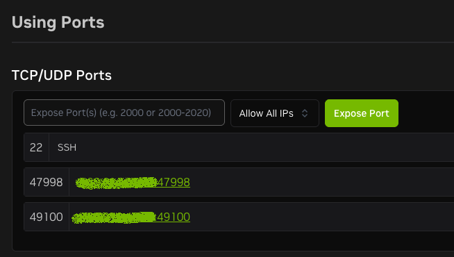

## Isaac Sim

An initial PoC for Isaac Sim. This repository contains a simple setup to demonstrate the requirements, installation steps, and basic usage of Isaac Sim.

## Deployment methods

- Locally
  - [headless](https://docs.isaacsim.omniverse.nvidia.com/5.1.0/installation/install_container.html#isaac-sim-setup-remote-headless-container) using docker ([container registry](https://catalog.ngc.nvidia.com/orgs/nvidia/containers/isaac-sim?version=5.1.0))
  - from source ([Github](https://github.com/isaac-sim/IsaacSim?tab=readme-ov-file#quick-start))
- Cloud
  - Brev - one click NVIDIA instances ([docs](https://docs.isaacsim.omniverse.nvidia.com/5.1.0/installation/install_advanced_cloud_setup_brev.html))


## Usage

To simply run the Isaac Sim container you can run [startup.sh](startup.sh) which will pull the repo (if needed) and run the container with the necessary volumes and ports.

the Isaac Sim container will run the following to run headlessly and enable remote access:
```
PUBLIC_IP=$(curl -s ifconfig.me) && ./runheadless.sh --/app/livestream/publicEndpointAddress=$PUBLIC_IP --/app/livestream/port=49100
```

The following ports must be open to allow remote access to the livestream:
```
UDP port 47998
TCP port 49100
```
*this is essential, without 47998 the handshake will fail and livestreaming will not work over 49100*


### Secure Setup

The docker compose also includes the ability to run a openSSH server and cloudflared tunnel, for that you will need to run the entire compose file (see below).

For the entire setup set the `CF_TUNNEL_TOKEN` in a `.env` file and run the compose file:

```bash
docker compose up -d
```

## Notes

This is a work in progress repo with the aim of committing a minimal working example of Isaac Sim usage. With the proposed approach being to spin up/down cloud GPU compute instances its vital to version control the setup steps as much as possible.

Key files:
- [compose.yml](compose.yml) - a compose file produced from the manual docker run commands in the installation steps documented [here](https://docs.isaacsim.omniverse.nvidia.com/5.1.0/installation/install_advanced_cloud_setup_brev.html#running-isaac-sim-container).
- [startup.sh](startup.sh) - a simple script to run the Isaac Sim container with the necessary volumes and ports. This is a simplified version of the compose file without the cloudflared tunnel and openSSH server. This can be copied into a Brev instance to run on startup.

Key services:
- `isaac-sim` - the main Isaac Sim container
- `cloudflared` - a Cloudflare tunnel container to expose SSH access to Isaac Sim for remote control
- `openssh-server` - an SSH server container to allow remote access into Isaac Sim via the cloudflared tunnel

Key Isaac Sim commands:
- `./isaac-sim.compatibility_check.sh` - determines hardware and OS compatibility
- `./runheadless.sh -v` - runs Isaac Sim in headless mode

I suspect the PUBLIC_IP can be mapped through cloudflare tunnel but I have yet to test it as my local hardware is not compatible with Isaac Sim.

Once up and running the following tutorials have been followed and work well in a Brev L40S instance:
- [Driving a TurtleBot using ROS 2 Messages](https://docs.isaacsim.omniverse.nvidia.com/5.1.0/ros2_tutorials/tutorial_ros2_drive_turtlebot.html)

### Brev

With the `isaac-sim` container running (in VM mode with `startup.sh` copied as a startup script), the instance is accessible via the Brev CLI and/or open the required ports (49100 and 47998) to enable livestreaming.



This can be made completely public or restricted to only your IP address. After this the IP address can be used to connect to the livestream in Isaac Sim.

#### Debugging

The Brev CLI can be used to access a shell in the instance and view logs in real time:

```bash
brev shell <instance-name>
```

from here you can run typical linux and docker commands to tail container logs

```bash
docker logs -f isaac-sim --follow
```

### Minimum requirements:

|Component|Isaac Sim 5.1.0 Minimum|
| ------- | -------------------- |
GPU Model|RTX 3070 (Turing+)|
VRAM|10 GB - 16 GB|
System RAM|32 GB|
CPU|i7 (7th Gen) / 4+ Cores|
Driver Version|535.161+|
Storage|50 GB SSD|
OS|Ubuntu 22.04+ / Windows 10+|
